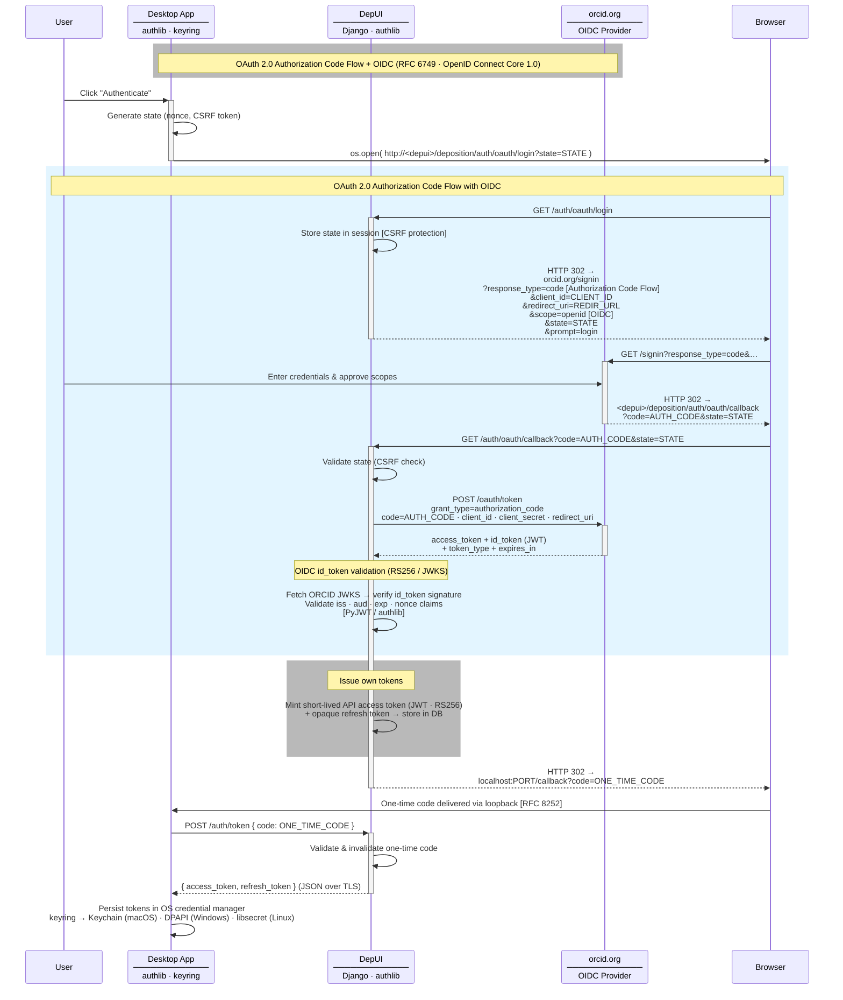
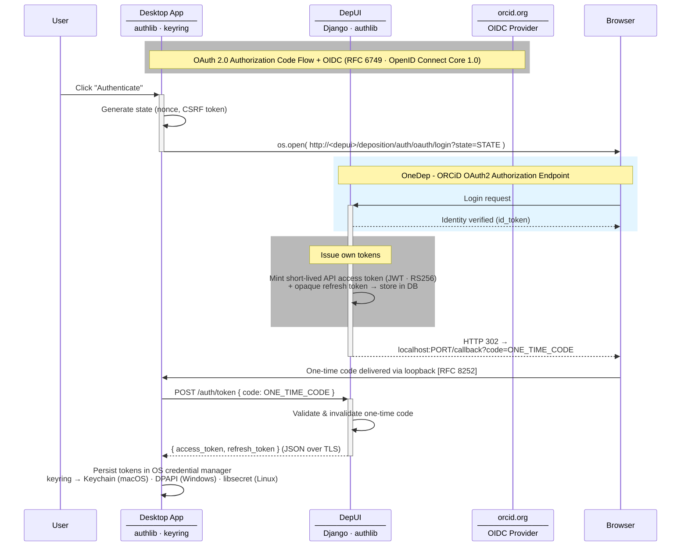

# Authentication Flow

OAuth 2.0 Authorization Code Flow + OpenID Connect (RFC 6749 · OpenID Connect Core 1.0 · RFC 8252)

## Simplified view

## Key decisions

| Aspect | Choice | Why |
|---|---|---|
| OAuth2 flow | Authorization Code | User-interactive; code never exposed to client |
| ORCID client type | Confidential (`client_secret`) | ORCID does not support PKCE; secret kept server-side |
| OIDC scope | `openid` | Gets signed `id_token` (JWT) instead of opaque ORCID token |
| id_token sig | RS256 + JWKS | Asymmetric — server verifies without shared secret |
| Our tokens | JWT (access) + opaque (refresh) | Short-lived JWT for stateless API auth; opaque refresh for revocation control |
| Token delivery | One-time code → POST exchange | Keeps tokens out of URLs (no browser history / log leakage) |
| Loopback redirect | `localhost:PORT` | RFC 8252 recommended pattern for native app token delivery |
| Credential storage | `keyring` | Cross-platform OS-native secure storage, no plaintext files |
